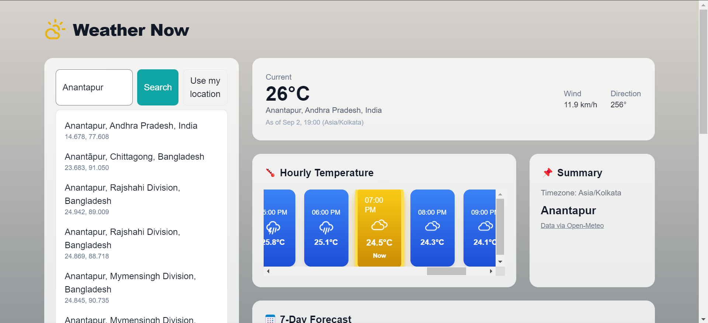
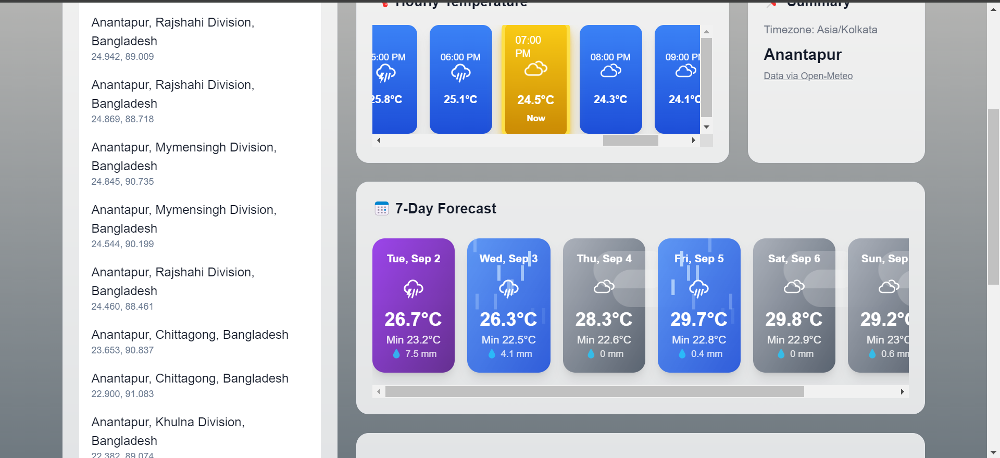
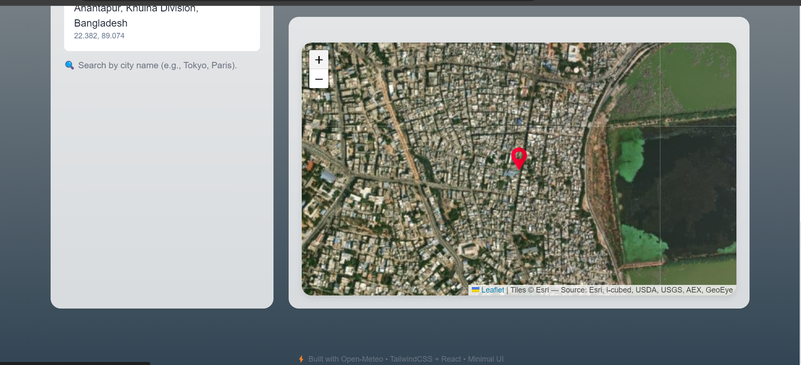

# 🌦️ Weather Now App

A modern, responsive weather application built with **React + Vite + TailwindCSS**.  
It provides real-time weather updates, hourly trends, and a 7-day forecast using the **Open-Meteo API**.

---

## 🚀 Live Demo
👉 [Weather Now App](https://weather-now-app-flax.vercel.app/)

---

## 📸 Screenshots

### Homepage


### Hourly Forecast


### Map View



## ✨ Features

- 🔍 **City Search** – Search weather by city name (e.g., London, Tokyo, Paris).  
- 📍 **Use My Location** – Fetch weather based on your current location.  
- 🌡️ **Current Weather** – Temperature, conditions, humidity, etc.  
- ⏳ **Hourly Forecast** – Sparkline chart showing hourly temperature trends.  
- 📅 **7-Day Forecast** – Beautiful, animated forecast cards with icons.  
- 🗺️ **Interactive Map** – City location rendered on map (Leaflet).  
- 📱 **Responsive Design** – Works smoothly on desktop & mobile.  
- 🎨 **Dynamic UI** – Background and cards change based on weather type.

---

## 🛠️ Tech Stack

- **Frontend:** React, Vite, TailwindCSS  
- **APIs:** [Open-Meteo Weather API](https://open-meteo.com/)  
- **Maps:** Leaflet  
- **Deployment:** Vercel  

---

## 📦 Installation & Setup

Clone the repository and run locally:

```bash
# Clone repo
git clone https://github.com/shaikabzal9676/weather-now-app.git

# Go inside project
cd weather-now-app/client

# Install dependencies
npm install

# Start development server
npm run dev

The app will be running at:
👉 http://localhost:5173/

🏗️ Build for Production
npm run build


This generates a dist/ folder with optimized production files.
Deployed live using Vercel.

📂 Project Structure
weather-now-app/
├── client/                # React frontend
│   ├── src/
│   │   ├── components/    # UI components
│   │   ├── App.jsx        # Main app
│   │   └── index.css
│   ├── package.json
│   └── vite.config.js
├── README.md
└── ...

🌍 Deployment

Deployed with Vercel
:

Connect GitHub repo.

Framework: Vite.

Build command: npm run build.

Output directory: dist.

Live at 👉 Weather Now App

🙌 Acknowledgements

Weather data: Open-Meteo

Icons: react-icons

Hosting: Vercel
